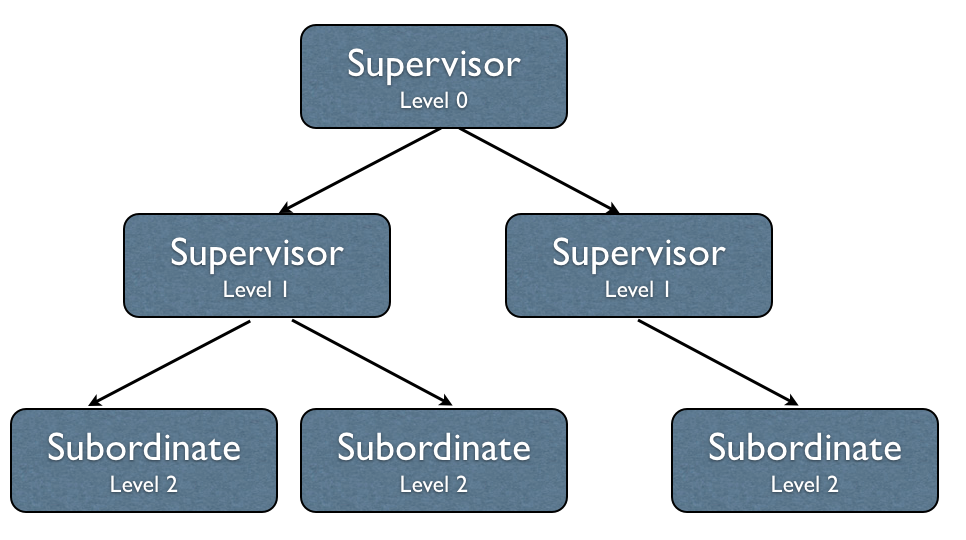
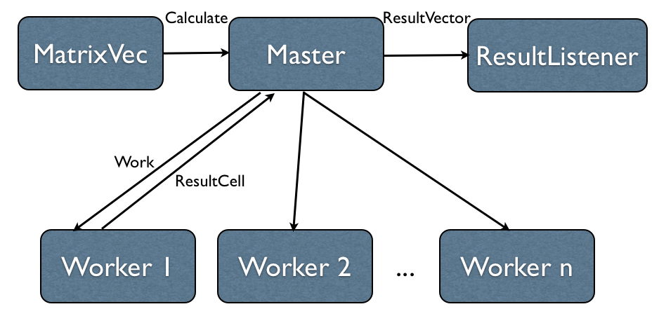
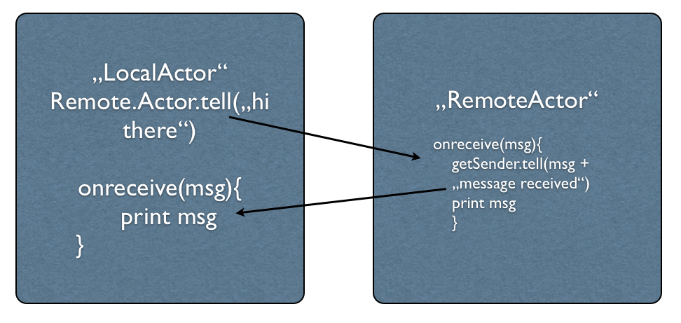
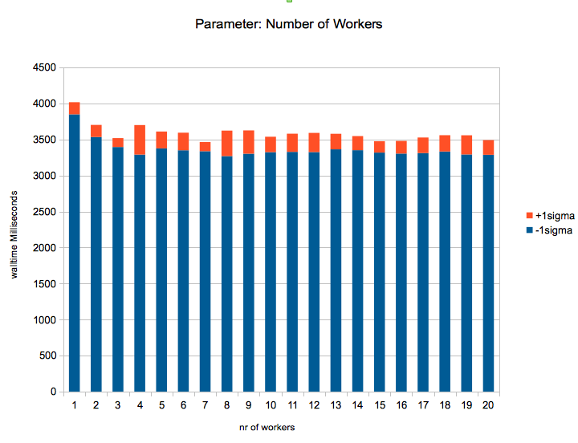
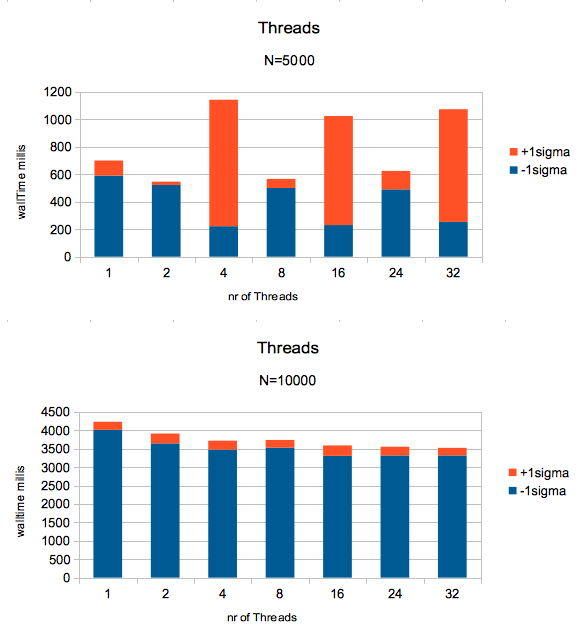

Parallel Architecture and Programming Models
============================================

Elaboration for the lecture _parallel architecture and programming models_ at the University of Vienna. 

Akka and Actors
---------------

# Java Concurrency

The existing Java-based concurrency model does not fit very well in the hardware multiprocessor model. This makes it very difficult to design scale up Java applications.

Java provides shared memory threads with locks as the primary form of concurrency abstractions. Shared memory threads are heavywight and incur severe performance penalties from context-switching overheads. Fork/Join models with concepts like work-stealing makes the task easier but requires a bit of expertise and tuning to write applications. 

# Actor Model

In 1973, Carl Hewitt, Peter Bishop and Richard Steiger introduced the Actor model, which was implemented at first in the Erlang programming language. The Actor Model avoids issues caused by threads and locks, because there is no shared state between actors. 

The Actor Model is based on the following principles:

* Actors communicate only via immutable messages, so nobody can access the state.
	
* Each actor has a messagebox attached, where the messages are enqueued. Only one message is processed one time. A actor can respond to a message by sending another message, creating a new set of actors and it could change its state or computational behaviour. 
	
* Messages are passed asynchronously, so the sender does not wait for a reply on his message. There is no guarantee for the sequence of the message arrivial and execution.  
	
* Having invocation and execution in seperate threads with no shared state, allows actors to provide a concurrent and scalable model. 
	
	
# Akka Framework 

Akka is an event based middleware runtime, written in Scala that run on the Java virtual machine and offers Java and Scala APIs. Its goal is to attain simplicity and performance at the same time. Large scale applications that depend on a complex programming model are difficult to maintain. Applications are deployed often across many servers and there is a need to get these applications done simpler and quicker using a simple programming model, like the underlying actor model. 

The rise of cloud service providers in the past years shows that there is a real need to deploy distributed applications on scalable infrastructure. To make proper use of these cloud services, applications obviously need to be more scaleable and distributed. 

The Akka Framework provides following features:

* Concurrency: The actor model abstracts concurrency and allows the programmer to focus on business logic

* Scalability: Asynchronous message passing allows applications to scale up on multicore servers

* Fault tolerance: Akka provides a "Let it Crash" fault tolerant model based on supervision hierachies to allow applications to fail fast and recover from the failure. 

* Event-driven architecture

* Transaction support: Akka implements transactors, that combine STM (software transactional memory) and actors to provide atomic retry and rollback

* Location transparency: Remote actors allows a programming model for multicore and distributed computing needs. 

* Test driven development

# Actor systems

Actor is the smallest, concurrent and independend computational unit which encapsulates _state_ and _behavior_. 

The _state_ of the actor is characterized by instance variables, in example: counters, listeners or references to resources or state machines. The state of the actor is only changed as a response to a message. 

The _behaviour_ or computation logic might include changing the actor state. 

Every actor is attached to exactly one _mailbox_, which enques the receiving messages in the order as they are sent. A mailbox can be limited to a number of messages that can be queued in the mailbox. It is also possible to use a priority mailbox, but Akka does not allow a scanning of the mailbox. With the use of _dispatchers_ it is possible to assign one mailbox to a group of actors. 

## Actors and the Java Memory Model

Prior to Java 5, the JMM (Java Memory Model) you observe very strange results, when shared memory was accessed by multiple threads. This was caused by a visibility problem to shared data and false ordering of instructions. With the implementation of JSR in Java 5 a lot of issues are resolved with the implemenation of "happens-before" relations. These relations ensure the correctness of the result in asynchronous concurrent system. The java specification is a balance between ease of use and ability to write performant and scalable concurrent data structures. With the Actor implementation in Akka, there are two ways to execute actions on shared memory: 

* a message is sent to an actor and is not properly constructed in an immutable object. It would be possible for the receiver to see partially initialzed data structures.

* if an actor makes changes to its internal state while processing a message, and acceses that state while processing another message moments later. 

To prevent visibility and reordering problems on actors, Akka guarantees two "happens-before" rules. _The actor send rule_ guarantees the send of the message happens before the receive within the actor. _The actor subsequent processing rule_ ensures processing of one message happens before processing the next message. 

# Fault tolerance and Supervision

Actors form hierachies. One actor might want to split up its task into smaller, more manageable pieces. For this purpose it starts child actors which it supervises. If one actor does not have the means for dealing with a certain situation, it sends a corresponding failure message (an exception) to its supervisor, asking for help. The recursive structure then allows to handle failure at the right level. The subordinate suspends itself and all its subordinates and sends a message to its supervisor, signaling failure. Depending on the nature of the work to be supervised and the nature of the failure, the supervisor reacts the following:

* resume the subordinate, keeping the internal state
* restart the subordinate, clearing out its accumulated internal state
* terminate the subordinate permanently 
* escalate the failure

Resuming an actor resumes all its subordinates, terminating an actor will also terminate all its subordinates. The default behaviour is to terminate all its children before restarting, but this hook can be overridden with the preRestart function. It is important to have a recursive fault handling structure and to have not too much at one level. This is why Akka implements a specific form of "parental supervision". Actors can only be created by other actors, where the top-level actor is provided by the library. 

_Restarting_ means execution of the following:

* suspend the actor and all children
* wait for all children until they have terminated
* create new actor instance by invoking the originally provided factory again
* resume the actor

## One-For-One Strategy vs All-For-One Strategy

There are two supervision strategies which come with Akka. The OneForOneStrategy, which is default, applies the obtained directive only to the failed child, whereas the AllForOneStrategy applies it to all siblings as well. 

Implementation Details
----------------------

# Setting up the programming environment

A good tutorial, which helps you to set up your programming environment could be found [here](http://doc.akka.io/docs/akka/snapshot/intro/getting-started.html "Getting Started Guide"). I have used [SBT build tool](http://www.scala-sbt.org/ "sbt guide") to set up the project environment and Eclipse to have some IDE support. To refresh your dependencies within eclipse I recommend to install and use [sbt eclipse](https://github.com/typesafehub/sbteclipse "sbt eclipse at github"). The following two commands within SBT were very helpful:

	reload
	eclipse with-source=true
	
# Matrix Vector example

The matrix and the vector are created in the MatrixVec class. This class sets up the Actor environment and sends a _Calculate_ message with the whole matrix and the vector to the _Master_ actor. The _Master_ actor splits up the matrix into rows and sends it with the vector to the worker. The order of the sending messages is not the same like the order of the receiving messages, so you also have to send an offset, which is then send back to the Master with the calculated result cell. The assembling of the resultvector is done in the Master. After finishing the calculation for each Worker the actor ResultListener is informed, which prints the resultvector. 

## Testing the Worker actor

I also provided a unit testcase for the _Worker_ actor. Akka provides a comprehensive mechanism to perform unit and integration tests on the application. Akka has a dedicated module, __TestKit__, that provides the requisite libraries with support in writing test cases. The premise of the TestKit is to enable the devolpers to test the functional code that is written. 

You have to set up the _application.conf_ file in your _src/main/resources_ directory. 

	TestSys {
		akka {
		    mode = test
		  	event-handlers = ["akka.testkit.TestEventListener"]
			loglevel = DEBUG
			actor {
				debug {
				 receive = on
				 autoreceive = on
				 lifecycle = on
				}
			}
		}
	}
	
Further implementation details to the testcase you can find  [here](matvec/src/test/scala/at/univie/pap/matrixvec/actors/TestWorker.scala).

# Akka Remoting

Once an application has reached the machine limit, you may want to scale out or distribute the application, so that the application can run on multiple machines. Akka therfore provides the concept of remote actors. To connect to a remote actor you need to deploy a jar file onto the akka microkernel.  The akka microkernel is just a simple bundling mechanism, that allows you to connect to the machine without an Java Application Server. You need to create a Bootable class that handels the startup and you have to put the jar file into the deploy directory of the akka microkernel.

## Remoting example

I implemented a very small example of Remoting actors. The RemoteActor system receives a message from the LocalActor system that is appended and returned in the back to the LocalApplication. The LocalApplication just prints out the message. The idea is to show how two actor systems running on two different machines communicate with each other. 

The server actor will be running on a particular IP address and port number. The [LocalActor](LocalNodeApp/src/main/scala/essentials/localnode) system will create a reference to the [Remote Actor](remoteapp/src/main/scala/essentials/remotenode) and pass a message to the Remoteactor. The RemoteActor responds back to the client with the original message along with an additional message appended to the same. 

# Benchmarking Akka

## Hardware Infrastructure

The Sun Fire X4600 M2 server is a compact (4 rack units), energy-efficient system. The machine houses 

 * 8 AMD Opteron 8218 Dual-Core processors with 2.6 GHz, for a total of 16 cores, 
 * each core has 1 MB Level 2 cache 
 * CPUs are connected to each other by a HyperTransport link running at 8 GB/seconds.
 * 32GB of main memory and two SAS (serial attached SCSI) harddisks. 
 * Operating System is Solaris 10 x86.

This system is known at the Research Group of Scientific Computing with the nickname _daisy_.

## Measurement

I have measured absolute runtimes, because the observed values show a really bad speedup. In the barchart there are 2 values which describe the observed runtimes, -1sigma and +1sigma. -1sigma is the arithmetic mean runtime minus one standard deviation. +1sigma is exactly 2 standard deviations. 

Because of the JVM's just in time compilation, which does additional performance tweaking within the running programm I started 3 times the programm before mesurement. Then I perform 10 measurements of the program.

## Measurement results

### Number of Workers

I have measured only the matrix-vector example. This plot shows the different number of workers with the same problem complexity of the matrix size of 10000. The number of worker represents the number of different working actors which could work within the same time. For a computation intensive problem, like calculating Pi ([Calculating Pi ath the Typesafe website](http://typesafe.com/resources/tutorials/getting-started-with-akka-scala.html)) you should observe quite a good speedup on a multi-core machine. The matrix-vector computation is a very data intensive problem, and for these problems a message would be sent from one core to the other. This is why you cannot really observe a speedup for this kind of problem with the underlying programming model.

### Number of Threads

In the Akka framework you have the opportunity to configure how many threads should be used in a specific range. This could be done within the configurationString.

		val configString1: String = """akka {
  		logConfigOnStart=off
  		executor = "thread-pool-executor"
  		fork-join-executor {
				parallelism-min = 3
				parallelism-factor = 2.0
				parallelism-max = 8
			}
		}"""

		// initialize the actor system with configuration above
		val system = ActorSystem("MatVecSystem", ConfigFactory.parseString(configString1))

There are three parameters, parallelism-min, parallelism-factor and parallelism-max. Parallelism-min is the minimum number of threads which is defined as 3 and the multiplier factor is 2.0, then the dispatcher starts with a minimum of 3 * 2 = 6 threads. The maximum number defines the upper limit on the number of threads. If the maximum number is 8, then the maximum number of threads will be 8 * 2 = 16 threads.

I have tried to observe some kind of speedup. The following two barcharts are made with 2 different complexity sizes (N=5000, N=10000). I've used following configuration:

 * parallelism-min = 1
 * parallelism-factor = 1.0
 * parallelism-max = number of threds displayed in the x-axis

For the barchart with the complexity size of N=5000, there are some runtimes (especially with 4, 16 and 32 threads), which have a really big standard deviation. I repeated the runtime analysis and printed every single runtime to the console. For these threadsizes I observed once in ten runs a really heavy outlier. The outlier decreases the value of -1sigma and increases the value of +1sigma. 

I assume the outlier runs are influenced by automatic memory management. This introduces hidden execution to the runtime. Every once a while, the execution is stopped and the garbage collector sweeps the memory for unused instances. For bigger complexity sizes it happens nearly every run, therefore we observe none of these outliers for N=10000.

Boxing and unboxing happens implicitly when passing a primitive type as an argument to a generic method. This induces also extra allocations and produce additional garbage on the heap, but this cannot effect different complexity sizes.

# Conclusions

Akka and its underlying actor model is very extensive and this work scratches only on the surface of the tweaking possibilities. Akka promises both, horizontal and vertical scalability, but you have to differentiate between data-intensive tasks and computation-intensive tasks. Akka is not suitable for data-intensive tasks like the matrix vector example, because the communication overhead is too large. 

Suitable problems for Akka are payment processing, invoicing, order matching, datacrunching, messaging. This also includes highly transactional systems like banking, betting or games. A really great framework for cloud-computing. 

The fault tolerance model with the supervision concept is great, but there is always one module which controlls all the message flow and the computation for all other nodes in a distributed system. This single-point of failure is still a challenge in distributed computing. 

Akka comes with two languages, Scala and Java. These two languages could be combined in one project. With the Appache-2.0 licence Akka could be used without license restriction. This elaboration was really fun and there are a lot of features within Akka, which I want to discover in the future.
